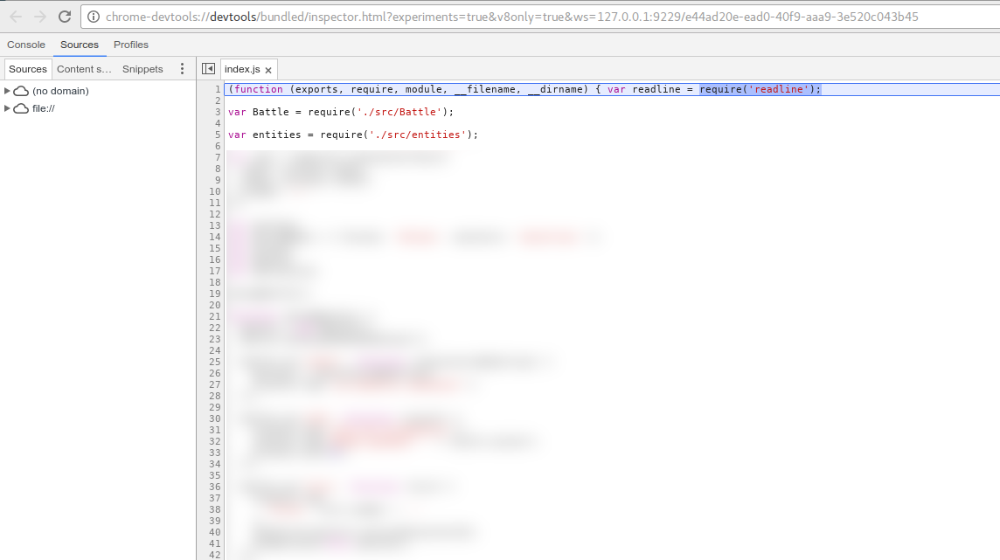
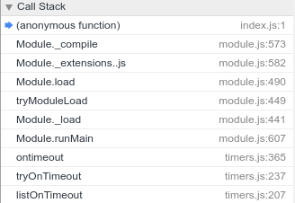
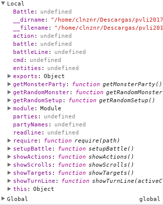

---
title: Depurar con `node.js` y Chrome
vim: spelllang=es
...

Encontrar fallos en el código puede ser muy difícil. Usar
`console.log`{.js}, a pesar de ser rápido, no suele ser lo más efectivo. Os
ofrece

# Depurar con `node.js`

## `node.js` versión 4

Para depurar con `node.js` usando la versión 4, debéis instalar el paquete
`node-inspector`{.sh}. Podéis hacerlo como usuarios normales, desde la raíz de
vuestro proyecto, de la misma forma que instaláis cualquier otro paquete:

```bash
npm install node-inspector
```

Una vez hecho eso, os habrá instalado en la carpeta `node_modules` un
ejecutable que lanza un entorno en Chrome para depurar.

Con esto, ya podemos arrancar nuestro programa en depuración:

```bash
node_modules/.bin/node-inspector $nombre_del_script.js
```

Al hacerlo, veremos esto en la consola (cuidado, tenemos que tener el puerto
8080 sin usar):

```bash
Node Inspector v0.12.8
Visit http://127.0.0.1:8080/?port=5858 to start debugging.
```

Desde Chrome, en la dirección `http://127.0.0.1:8080/?port=5858`, veremos una
sesión de depuración.


## `node.js` versión >=6

Las últimas versiones de `node.js` tienen integrado soporte para [Chrome
DevTools](https://developer.chrome.com/devtools). Esto quiere decir que podemos
tener depuración gráfica sin necesidad de instalar ningún paquete adicional.

Para depurar con versiones "nuevas", hay que arrancar `node.js` en modo
depuración:

```bash
node --inspect $nombre_del_script.js
```

O, si queremos que pare directamente en la primera línea:

```bash
node --inspect --debug-brk $nombre_del_script.js
```

En ambos casos, aparecerá información sobre la URL que usar para ver el
entorno gráfico de depuración:


```bash
To start debugging, open the following URL in Chrome:
    chrome-devtools://devtools/bundled/inspector.html?experiments=true&v8only=true&ws=127.0.0.1:9229/e534159e-47e1-47f4-9a7c-0b5f3cb98c50
```

Yendo a esa URL, veremos la interfaz de depuración. Ahora, veamos cómo usar esa interfaz.


# Depurar con Chrome

Una vez que hemos llegado a lanzar el navegador desde `node.js`, podemos
empezar a depurar gráficamente. Es importante tener en cuenta que esto no sólo
se puede hacer desde `node.js`, sino desde Chrome directamente accediendo a las
*DevTools* (`F12`, o desde el menú de Chrome). Es decir, que tanto con archivos
cargados desde `node.js` como para archivos JavaScript que estemos ejecutando,
siempre podemos ir a la interfaz de depuración. Tiene este aspecto:



Esta ventana es muy similar a cómo funciona un depurador en aplicaciones como
Visual Studio. A la derecha, arriba, tenéis los controles de depuración para
ejecución paso a paso:


También tenéis la pila de llamadas, para ver y acceder al contexto que os ha
llevado hasta el punto actual:



Y la lista de variables, cada una de las cuales podéis desplegar y examinar con
detalle:



Para poner un punto de interrupción, sólo tenéis que hacer clic en un número de
línea, y éste se marcará en azul. Cuando la ejecución llegue a la línea, se
detendrá para que podáis examinar el estado:


Hay muchas más opciones y técnicas para depurar JavaScript. A partir de esta
información, no debería ser difícil encontrar lo que buscáis en Internet o
preguntando en el foro de la asignatura.
