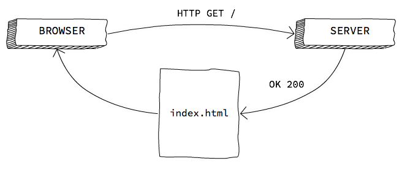

# JavaScript en el navegador


## ¿Por qué?


Si queréis publicar juegos en la web, _necesitáis_ saber cómo funciona un navegador, y cómo funciona la web


### ¿Por qué conocer los navegadores?

- Hay consideraciones técnicas a tener en cuenta, tanto a nivel de interfaz como de seguridad
- ¡Herramientas de desarrollo! Debugger, profiler, network requests, etc.


### ¿Por qué conocer tecnologías web?

- Como poco, vuestro juego deberá estar contenido en una página web (HTML), que tendrá cierta apariencia (CSS).
- Es útil para implementar cosas como un botón de fullscreen, o una splash screen, o usar fuentes custom en vuestros juegos
- Si tenéis un bug, necesitáis conocimientos de APIs Web para poder debuggar con éxito (p.ej la API de Gamepad, o WebGL)
- Si queréis modificar el engine o framework para añadir features o arreglar un bug…


## Navegadores


- Son programas que permiten acceder a la Web
- ¡No todos los navegadores son iguales!
    - No todos incluyen el mismo motor de renderizado. P.ej: Gecko (Firefox), Blink (Chrome, Opera)
    - No todos incluyen la misma VM de JavaScript. P.ej: SpiderMonkey (Firefox), V8 (Chrome)


### ¿Cómo detectar qué soporta cada navegador?

- [caniuse.com](http://caniuse.com), rápida e intuitiva
- [MDN](http://developer.mozilla.org), tiene detalles concretos sobre la implementación y diferencias entre navegadores


## Lenguajes en la web


### HTML

- Representa el **contenido** de una página: párrafos, títulos, imágenes, vídeos, elementos de canvas, etc.

- Es un lenguaje de **marcado** basado en etiquetas. P.ej:

```
<h1>Esto es un título</h1>
```


### CSS

- Nos permite personalizar la **apariencia** de los elementos HTML: colores, fondos, bordes, posición, columnas, tamaños…

- Es un lenguage **declarativo** basado en reglas. P.ej:

```
h1 {
  color: red;
}
```


### JavaScript

- Nos permite implementar **comportamiento** y **lógica**.

- Es un **lenguaje dinámico** orientado a prototipos, con características funcionales.

```
console.log("Hello, world!");
```


## ¿Qué pasa cuando accedéis a una web en un navegador?


### 1. Petición HTTP GET a un servidor



Se hace un HTTP GET a una URL, y si el recurso existe, el servidor lo retorna.


### 2. Descarga de archivos


Los archivos HTML pueden hacer referencia a otros recursos… que el navegador deberá pedir al servidor.

Mientras tanto, se va renderizando el HTML descargado.


### 3. ¡Un JS salvaje apareció!
