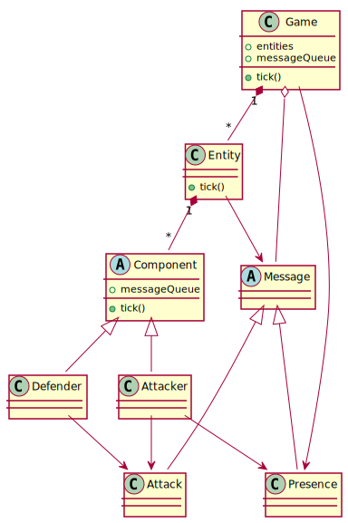

---
title: Un ejemplo concreto de componentes
#author: Carlos León
#date: 18/10/16
#vim: spelllang=es
...

# Una implementación de arquitectura de componentes en JavaScript

##

Vamos a implementar un sistema *muy simple* de entidades, componentes y
**mensajes**

<p class="fragment">Hasta ahora no hemos visto los *mensajes*, pero son una
técnica muy usada para **desacoplar** los componentes, y las entidades</p>


# Arquitectura

##




## `Game` → el juego

El juego tiene:

- Una lista de `Entity`
- Una cola de `Message`
    - Los mensajes se meten en la cola
    - El juego los "reparte"


## `Entitiy` → las entidades

En una arquitectura simple de componentes, una `Entity` es poco más que una
lista de componentes 

Esto significa que todo lo "interesante" estará **delegado** en los componentes


## `Component` → los componentes

Los componentes tienen realmente el modelo del juego

Veremos varios componentes que hacen cosas particulares


## `Message` → los mensajes

Los sistemas de paso de mensajes son muy flexibles, pero aumentan la
arquitectura y tienen *impacto en la eficiencia*

# Bucle principal

## ¿Qué es el bucle principal?

Es un *bucle* que se ejecuta durante todo el juego

En cada ciclo:

- Se lee la entrada
- Se actualiza el estado
- Se vuelve a pintar
- Se envían los mensajes pendientes
- Se comprueban colisiones
- ...

## Cómo es un *main loop*

```js
while(juegoContinua()) {
    dt = tiempoDesdeLaIteracionAnterior() // unos pocos ms
    entrada = leerEntrada();
    estado = actualizarEstado(entrada, estadoAnterior, dt);
    pintarEstado(estado);
}
```

