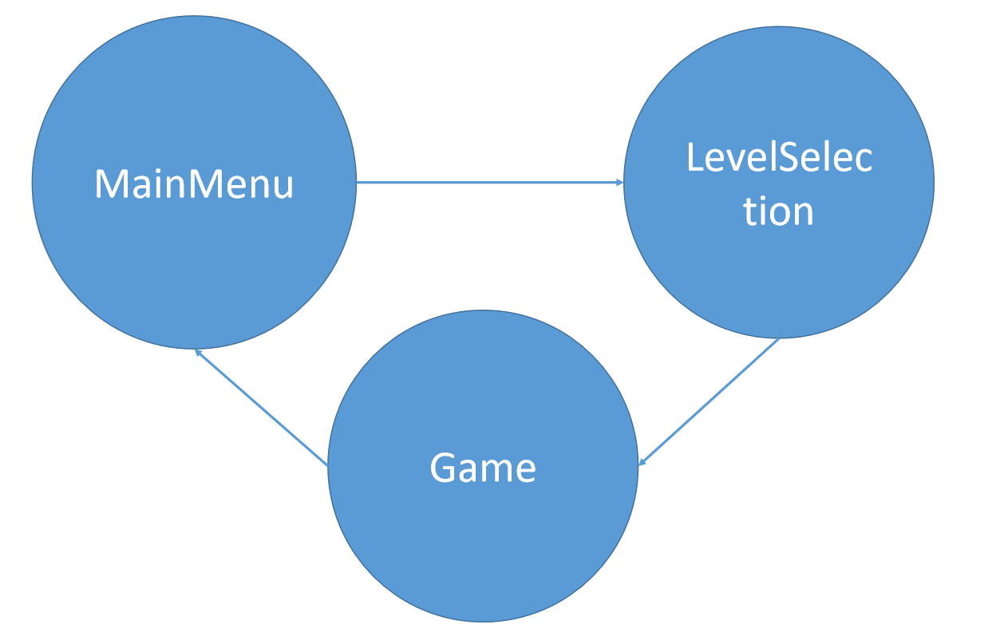
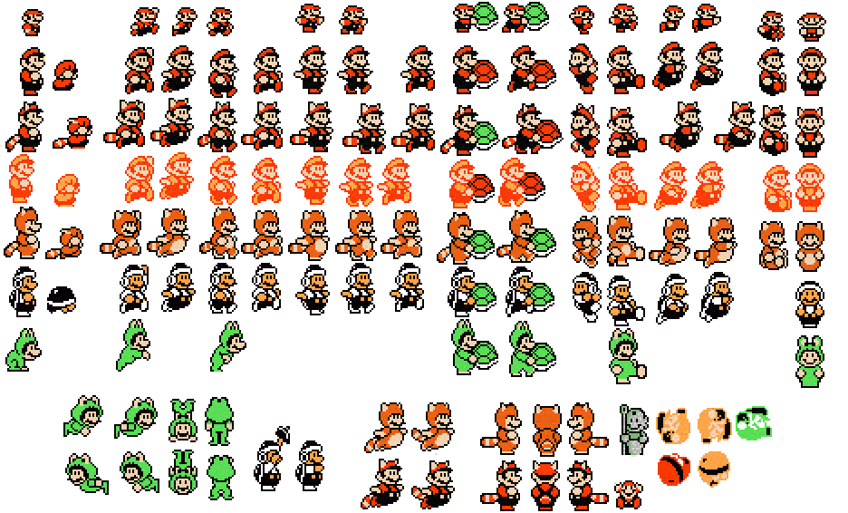

Podemos ver la definición de URI en la RFC de *Tim Berners-Lee* [RFC 3986: Uniform Resource Identifier (URI)](https://tools.ietf.org/html/rfc3986)

"Uniform Resources Identifier (URI) es una secuencia compacta de caracteres que identifica un recurso abstracto o físico".

"El nombre de Uniform Resource Locator (URL) es un subconjunto de URIs que además de identificar el recurso, proveen al mismo de una semántica de localización"

Los URNs (Uniform Resource Name) sólo identifica (el nombre de una persona) las URLs también localizan (nos llamamos usando la dirección en la que vivimos).

Ejemplos:

* ftp://rediris.com/resourcea : URL and URN
* +34555555555 URN
* urn:isbn:0451450523 URN
* http://es.wikipedia.org/wiki/Wikipedia:Portada URN and URL

El directorio especial ../ indica el directorio padre del que se lanzó la aplicación. El directorio ./ indica el directorio
de lanzamiento de la aplicación.


---


Cómo se crea una URI:


## Game States

Los estados de Phaser son la unidad mínima que maneja el framework para crear una escena de juego. Podríamos decir que es equivalente a la *Scene* de Unity.

Piensa en un State como en un capítulo de un libro. Pero *sólo un Stat está activo al mismo tiempo*. Podemos cambiar entre estados, pero sólo uno puede estar activo.

Es decir no podemos declarar un player Stat,  o un Power Up state. Eso son entidades no stats.

Los stats no tiene propiedades de visualización. Los Stats no son objetos renderizables. Son los objetos del Stat los que son renderizables.

Los Stats sirven para controlar el flujo de juego.


---

{height=75%}

## Estructura de un State

Un State es un objeto de Javascript que contiene una serie de métodos ya definidos. 


Un estado es válido si hay, al menos uno de estos métodos: *preload*, *create*, *update* o *render*. Si no existe alguno de estos métodos, Phaser no carga el State.

La gestión del State la realiza el *StateManager*. El StateMnager es el encargado de gestionar los states. Si no se va a usar un método no es necesario re-declararlo.

---


<!-- imagen dle flujo de las llamadas a State -->

{height=50%}


---


Además, Phaser proporciona una serie de propiedades que podemos utilizar en nuestro juego:

<!--  ponemos algunas propiedades -->
* game: La instancia de juego de Phaser.
* add: La factoría de GameObject.
* camera: La cámara.
* input: La entrada de Phaser.
* load: el cargador de load.
* sound: el sistema de sonido
* state: el StateManager.
* time: el manager de tiempo.
* particles: el sistema de partículas.
* physics: el sistema de físicas.

Mayoritariamente, estas propiedades son formas de acceder a los subsistemas de Phaser.

#Ejemplo básico de un juego con Phaser

---


```html
<!doctype html>
<html>
    <head>
        <meta charset="UTF-8" />
        <title>hello phaser!</title>
        <script src="../phaser/build/phaser.min.js"></script>
    </head>
    <body>

    <script type="text/javascript">
    window.onload = function() {

        var game = new Phaser.Game(800, 600, Phaser.AUTO, '', { preload: preload, create: create });

        function preload () {game.load.image('logo', 'phaser.png');}

        function create () {
            var logo = game.add.sprite(game.world.centerX, game.world.centerY, 'logo');
            logo.anchor.setTo(0.5, 0.5);
        }};
    </script>
    </body>
</html>
```

---

Ejemplo de states:

```js
var boot = function(game){
	console.log("Comenzando el juego", "color:white; background:red");
};
  
boot.prototype = {
	preload: function(){
          this.game.load.image("loading","assets/loading.png"); 
	},
  	create: function(){
		this.scale.scaleMode = Phaser.ScaleManager.SHOW_ALL;
		this.scale.pageAlignHorizontally = true;
		this.scale.setScreenSize();
		this.game.state.start("Preload");
	}
}
```


---


```js
var preload = function(game){}
 
preload.prototype = {
	preload: function(){ 
          var loadingBar = this.add.sprite(160,240,"loading");
          loadingBar.anchor.setTo(0.5,0.5);
          this.load.setPreloadSprite(loadingBar);
		this.game.load.spritesheet("numbers","assets/numbers.png",100,100);
		this.game.load.image("gametitle","assets/gametitle.png");
		this.game.load.image("play","assets/play.png");
		this.game.load.image("higher","assets/higher.png");
		this.game.load.image("lower","assets/lower.png");
		this.game.load.image("gameover","assets/gameover.png");
	},
  	create: function(){
		this.game.state.start("GameTitle");
	}
}
```


---


¿Cómo cargamos esto en la página Web?

```html
    	<script src="phaser.min.js"></script>
    	<script src="src/boot.js"></script>
		<script src="src/preload.js"></script>
		<script src="src/gametitle.js"></script>
		<script>
			window.onload = function() {
				var game = new Phaser.Game(320, 480, Phaser.CANVAS, "game");
				game.state.add("Boot",boot);
				game.state.add("Preload",preload);
				game.state.add("GameTitle",gameTitle);
			};    
		</script>
```

#Localización de los recursos

---

Para localizar los recursos podemos usar *baseURL* y *crossOrigin* del subsistema load.

*BaseURL* es el lugar donde están los recursos. Si los recursos no están en el mismo sitio que el código
podemos establecer aquí la url base para no tener que escribirla constantemente en el método de carga concreto.

*Cross-origin resource sharing (CORS)* es un mecanismo de control y restricción de recursos en una página web cuando un
recurso es solicitado por otro dominio. CORS define la forma en la que el navegador debe interactuar con el servidor.

[MDN de Cross Origin](https://developer.mozilla.org/en-US/docs/Web/HTML/CORS_settings_attributes)

---


*anonymous* significa que no hay ningún intercambio de credenciales entre cliente y servidor.
*use-credentials* significa que para acceder al recurso hay que tener credenciales.

Algunos ejemplos:

```js
function preload() {

    game.load.baseURL = 'http://examples.phaser.io/assets/';
    game.load.crossOrigin = 'anonymous';
}
```

```js
function preload() {

    game.stage.backgroundColor = '#85b5e1';

    game.load.baseURL = 'http://examples.phaser.io/assets/';
    game.load.crossOrigin = 'anonymous';
}
```

#Carga de recursos en memoria

---

Una vez que tenemos el origen de los recursos podemos cargarlos en memoria.
Se le añade un nombre al recurso para poder identificarlo.

```js
function preload() {

    game.load.baseURL = 'http://examples.phaser.io/assets/';
    game.load.crossOrigin = 'anonymous';

    game.load.image('phaser', 'sprites/phaser-dude.png');

}
```

---

```js
function preload() {

    game.stage.backgroundColor = '#85b5e1';

    game.load.baseURL = 'http://examples.phaser.io/assets/';
    game.load.crossOrigin = 'anonymous';

    game.load.image('player', 'sprites/phaser-dude.png');
    game.load.image('platform', 'sprites/platform.png');

}
```


---


podemos cargar diferentes recursos como: imágenes, archicos JSON, Atlas de textura, video, sonido, tilemaps...

La función *onLoadComplete* nos informa de la finalización de la carga. 

```js
onLoadComplete: function() {

  this.ready = true;

}
```

*isLoading* nos informa de que aún estamos cargando recursos.

#Liberación de recursos

---

Si cambiamos de stat y no vamos a volver al mismo, es muy probable que haya recursos que ya no utilizaremos
nunca. En este caso podemos eliminarlos de la cache. Hay que usar la key asignada en la carga.

```js
cache.removeImage(key)
cache.removeXML(key)
```

#Sprites en phaser

---

Son las imágenes 2D que sirven para visualizar los objetos en un juego 2D.  En Phaser se cargan así:

```js
player = game.add.sprite(100, 200, 'player');
```

{height=75%}
Hay que usar la key se le puso en la carga.

#Spritesheet o Atlas de Sprites.

---

{height=75%}

Sirven para optimizar recursos, accesos al servidor (No es lo mismo traerse una imagen grande con muchas imágenes pequeñas que mucuhas imagenes pequeñas individuales) además de que es más eficiente en memoria.

---

Sirve también para crear animaciones por frames.

```js
function preload() {

    //  37x45 is the size of each frame
    //  Hay 18 frames in the PNG
    game.load.spritesheet('mummy', 'assets/sprites/metalslug_mummy37x45.png', 37, 45, 18);
}

function create() {

    var mummy = game.add.sprite(300, 200, 'mummy');
    var walk = mummy.animations.add('walk'); //[0, 1, 2, 3, 4, 5, 6, 7, 8, 9, 10, 11, 12, 13, 14, 15 ...]
    mummy.animations.play('walk', 30, true);
}
```
