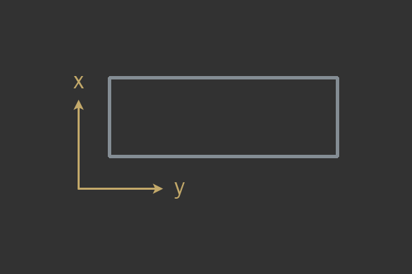
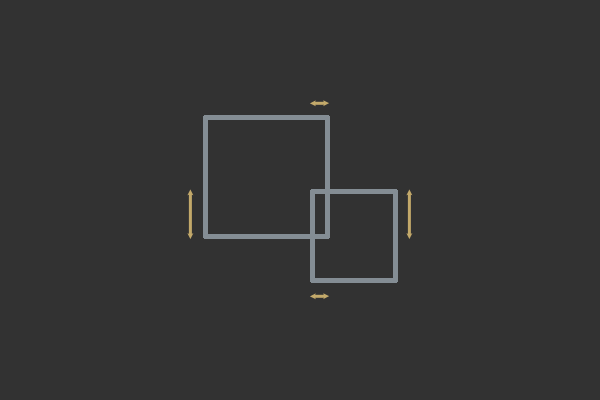

**Arcade Physics**: pensado para tratar colisiones AABB (axis-aligned bounded rectangles) es decir para manejar objetos sin rotaciones, y sólo se comprueba si existen colisiones (solapamiento o overlapping) entre dos rectángulos. Tiene problemas con las áreas transparentes. (Juegos sencillos)


---


**Ninja Physics**: Admite rotaciones, y formas más complejas, cuestas, con más precisión, pero también más lento. (Un juego de plataformas sin física compleja usaría este motor)


---

**P2 Physics**: Tiene un modelo de física mucho más avanzado, springs (muelles), polígonos, fuerzas, restricciones. (Angry Birds usaría este motor). 


## ¿Qué es una colisión?


Cuando dos bounding box están solapados.

Un **Bounding Boxe** es una caja que representa el objeto (lo simplifica). El tamaño por defecto del Bounding Boxe de phaser
es el tamño del sprite.

Esto es un Bounding Boxe




---


Y esto es una colisión entre dos Bounding Boxes (overlapping)





## ¿Cómo se calcula la colisión?


Las colisiones más sencillas del motor Arcade son colisiones AABB que se peuden calcular de la siguiente manera


```c
//pseudocódigo en C++
bool AABBvsAABB( AABB a, AABB b )
{
  if(a.max.x < b.min.x or a.min.x > b.max.x) return false
  if(a.max.y < b.min.y or a.min.y > b.max.y) return false
  return true
}
```


Phaser las calcula por nosotros


# El motor físico Arcade


## Inicialización del motor arcade


[Ejemplo del uso del motor arcade](https://phaser.io/sandbox/edit/rGYAfFoJ).


Para iniciar el motor de fisica:

```js
this.game.physics.startSystem(Phaser.Physics.ARCADE);
```


## Agregar entidades a la física


```js
this.player = game.add.sprite(100, 200, 'player');
this.game.physics.arcade.enable(player);
```


## Colisionar con los límites del del mundo.


```js
player.body.collideWorldBounds = true
```


## Crear grupo que colisione con un sprite


Se utiliza **physicsGroup**;

```js
    platforms = game.add.physicsGroup();

    platforms.create(500, 150, 'platform');
    platforms.create(-200, 300, 'platform');
    platforms.create(400, 450, 'platform');
    platforms.setAll('body.immovable', true); //se establece como plataformas estáticas
```

## Chequear colisiones entre dos objetos.


Si solo queremos chequearla...

```js
this.game.physics.arcade.collide(player, platforms);
```


---

Pero si queremos que nos avisen si hay colisión hay que cargar un evento: 


```js
this.game.physics.arcade.collide(player, platforms,onCollision);


//el método recibe dos parámetros
function onCollision(obj1, obj2)
{
//do something
}
```

--- 


**Collide** tambien devuelve un booleano que se puede consultar si ha habido colisión:

```js
    if(!game.physics.arcade.collide(player, platforms, onCollision))
    {
        textInfo.text = "No hay colision";
    }
```


## Colisiones con un tilemap


Ejemplos sacados de el ejercicio numero 3

```js
        //Creamos el tilemap y sus layer
      this.map = this.game.add.tilemap('tilemap');// creo el map al vuelo o lo predefino en el objeto...
      this.map.addTilesetImage('patrones','tiles'); //Asignar el patron al spritesheet.
      //Creacion de las layers
      this.backgroundLayer = this.map.createLayer('BackgroundLayer');
      this.groundLayer = this.map.createLayer('GroundLayer');
      //plano de muerte
      this.death = this.map.createLayer('Death');
      
      //le decimos que 
      this.map.setCollisionBetween(1, 5000, true, 'GroundLayer');

     var collisionWithTilemap = this.game.physics.arcade.collide(this._rush, this.groundLayer);
```


## Colision en un intervalo


* Colisiona con el rango de tiles que se indican en start - stop. 
* Collides es un boolean que activa o desactiva la colisión.
* Layer es donde opera => la capa del tilemap. 


```js
setCollisionBetween(start, stop, collides, layer)
```

---


### Colision por exclusión:


* Indexes array con los tiles excluidos.
* Collides es un boolean que activa o desactiva la colisión.
* Layer es donde opera.

```js
setCollisionByExclusion(indexes, collides, layer, recalculate)

map.setCollisionByExclusion([93,94,95,96], true);
```

---


### Colisión con toda la layer del tilemap


```js
setCollision(collides, layer)

//podeis sustituir en la práctica por esto:
this.map.setCollision(true, 'GroundLayer');
```


